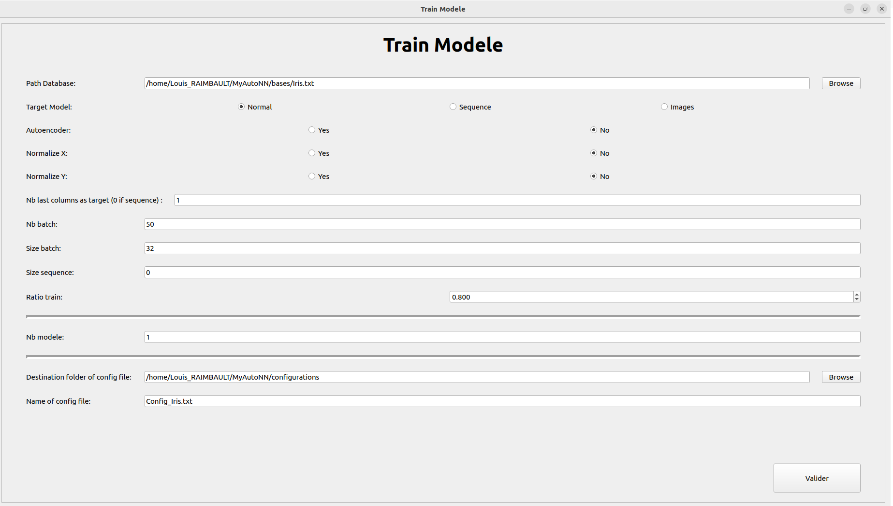
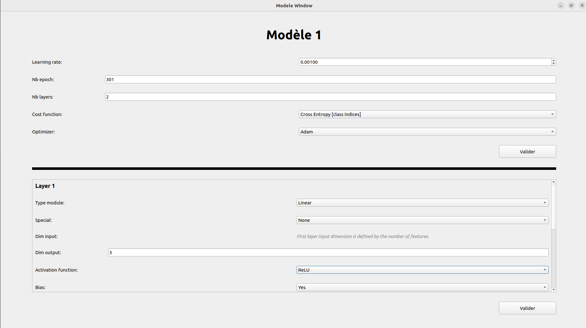
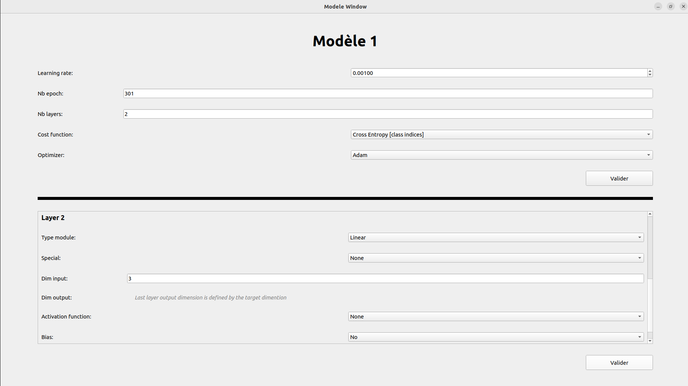
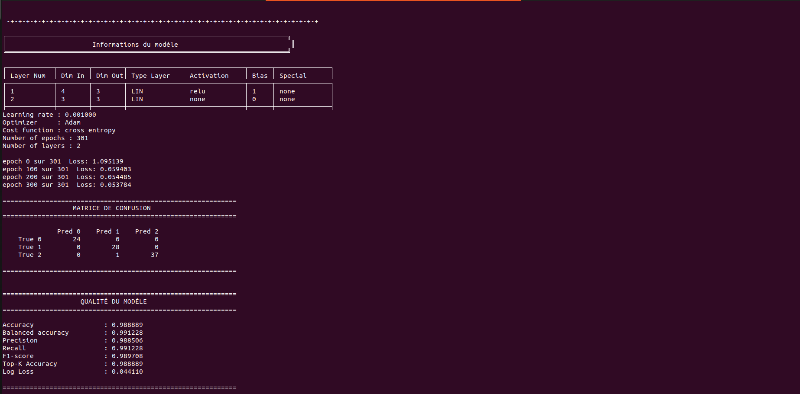
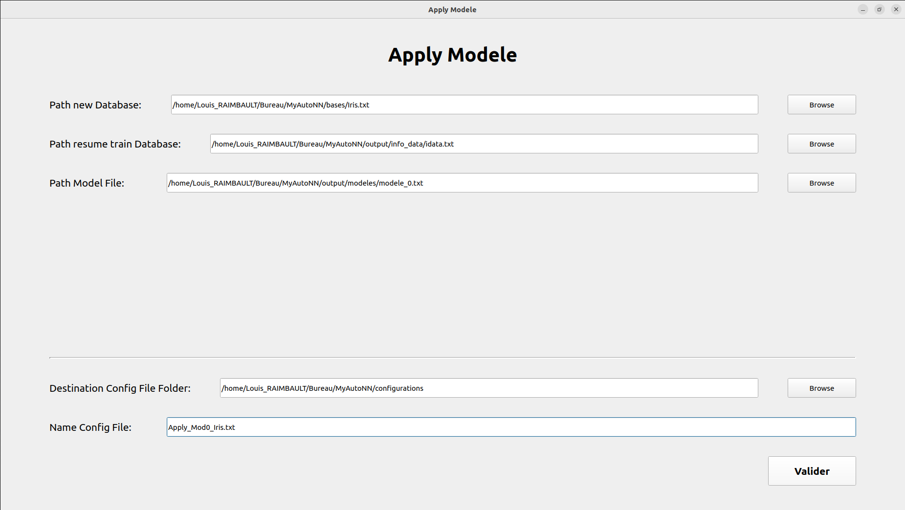
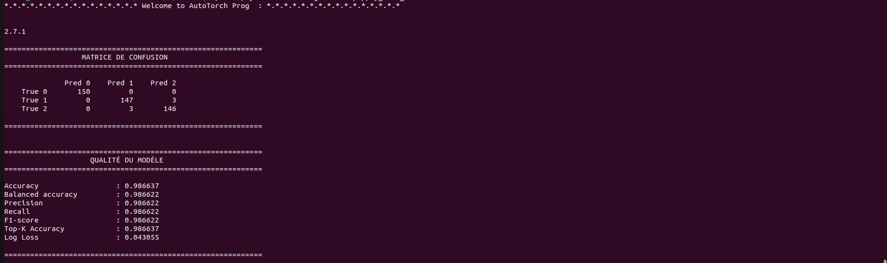

# MyAutoNN

## Description

**MyAutoNN** is a software tool designed to assist in the automation of training and applying artificial intelligence models.

This project is developed during my free time and is also used internally to support some of my professional projects in an enterprise context.  
The goal of MyAutoNN is to simplify and standardize the process of configuring, training, evaluating, and comparing machine learning models.

The software is built on top of **PyTorch’s C++ API (libtorch)**, allowing efficient execution and strong integration with C++ environments.

---

## Functionality

MyAutoNN provides a **graphical user interface (GUI)** developed using **Qt (C++)**.

Through this visual interface, the user is guided step by step to:
- Configure the training of one or multiple models, or
- Configure the application (inference) of an existing model.

Once the configuration is completed, a **configuration file is generated**.  
The actual execution is currently done via **command-line interface (CLI)**.

If training is selected:
- One of the outputs is a **LaTeX report file**.
- This file can be compiled to visualize results and **compare multiple models** in a structured and reproducible way.

---

## Dependencies

This software requires the following dependencies:

- **libtorch**  
  The user must manually download the libtorch  (compatible with version 2.7.1) library and place it inside the `external/` directory of the project.

- **Qt (C++)**  
  Qt must be installed on the system. There is no specific constraint regarding the installation path for this software.

---

### Download libtorch

MyAutoNN relies on **PyTorch’s C++ API (libtorch)**.

To install it, go to the official PyTorch website:

https://pytorch.org/get-started/locally/

On this page:
- Select **LibTorch** as the package
- Select **C++** as the language
- Download a **libtorch version compatible with PyTorch 2.7.1**

After downloading, extract the archive and place the resulting `libtorch/` directory inside the project’s `external/` folder.


### Installing Qt (Linux)

MyAutoNN requires **Qt with QMake version 3.1**, which corresponds to **Qt 5.15.x** or **Qt 6.x**.

On Linux, Qt can be installed either via the system package manager or using the official Qt installer.

---

####  Install Qt using the system package manager (recommended)

Most Linux distributions provide a compatible version of Qt along with QMake 3.1.

On **Ubuntu / Debian**:


```
sudo apt update
sudo apt install qtbase5-dev qtchooser qt5-qmake qtbase5-dev-tools

```


## Getting binaries

This project produces **two binaries** in the 2 **build** folders:
- The **core Autotorch engine (CLI)**: `MyAutoNN`
- The **graphical user interface (GUI)**: `qt_app`

Before building, make sure all dependencies (libtorch and Qt) are correctly installed and configured.

---

### Build the core engine (CLI)

From the root of the project, run:

```
./easymake.sh
```

### Build the qt (GUI)

From the root of the project, run:

```
cd QT
./QT_easymake.sh
```


## Current Capabilities

At its current stage, MyAutoNN supports the training of neural network models for:

- Datasets with a **single target column**
- **Single-column sequence prediction** (next element prediction)
- **Autoencoder models** for single-column sequences

---


## Use Software

Once the binaries are built, you can use the software firstly with the **Qt graphical interface** and then using **command-line interface (CLI)**.

---

### Using the Qt GUI

To launch the GUI, run:

```
./QT/build/qt_app
```

select either model training or model application, then follow the step-by-step guidance
in both cases, a configuration file will be generated

**if you choose to train model, run** 

```
./build/MyAutoNN 1 pathConfigtrain
```

When you train one or more models, at least three output files will be generated.

In output/info_data, an **idata.txt** file is generated. This file contains the information necessary to run one of the models on another database. For example, the data needed to reconstruct the maps required for one-hot encoding of qualitative variables.

In output/latex_quality, there is a quality_modeles.txt file that you can compile (pdflatex for example) to generate the PDF file useful for analyzing the results of the models and comparing them.

The configuration files for rebuilding the models will be located in output/models. Starting with 0, the files will be named model_x.txt

Important: the software currently does not handle invalid model architectures, incorrect configuration files, or incompatible model setups. Using such files may result in a segmentation fault or a Torch error."

**if you choose to apply model, run** 

```
./build/MyAutoNN 2 pathConfigapply
```
In this case, you must select the database file, the initial database information file, and the template file.


## Example 

In the database/ folder, you will find an Iris.txt file containing a known (duplicate) dataframe with the variables Sepal.Length, Sepal.Width, Petal.Length, Petal.Width, and Species. The first four variables are quantitative, while the target variable (in the last column) is qualitative.

The following screenshots provide an example of how to use the software.

Here are some screenshots of the Autotorch interface and workflow:

| Train Model First Page| Model First Layer | Model Second Layer |
|-------------|----------------|-----------------|
|  |  |  |


You can now run
```
./build/MyAutoML 1 configurations/Config_Iris.txt 
```

You should see in your terminal something like this 



You can now use the possibility to apply the model on another database, for this example we'll keep the same Iris.txt (which is quite stupid, I know, it's just to illustrate)



You can now run
```
./build/MyAutoML 2 configurations/Apply_Mod0_Iris.txt
```


You should see in your terminal something like this 


## Next Steps

Planned future improvements include:

- Adding a **prediction** output for application modele  

- Adding **optimizer hyperparameter selection**:
  - Weight decay
  - Momentum / beta parameters
  - Optimizer-specific options

- **Random model generation** based on user-defined preferences:
  - Automatic architecture sampling
  - Training multiple candidates
  - Extraction and comparison of the **top-k best performing models**

- Adding **image prediction** capabilities:
  - Image dataset import
  - Convolutional neural network (CNN) methods

- Support for **multimodal prediction**
